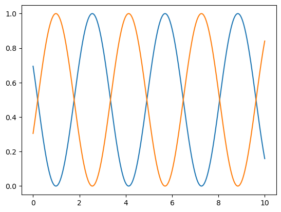

En este apartado se va a ejemplificar el uso de este codigo paso a paso mediante ejemplos proporcionados a lo largo de la ejecución del laboratorio.

Se parte importanto las bibliotecas necesarias y definiendo un operador oOper y un estado yInit
```python
import numpy as np
import matplotlib.pyplot as plt

oOper = np.array([[0,1],[1,0]])

yInit = np.array([[1,0],[0,0]])
```

Se definen las funciones principales del código, acá se encuentra el código de Runge Kutta 4
```python
def dyn_generator(oper,state):
    return (np.dot(oper,state)-np.dot(state,oper))*(-1.0j)

def rk4(func,oper,state,h):
    k1 = h*func(oper,state)
    k2 = h*func(oper,state+(k1/2))
    k3 = h*func(oper,state+(k2/2))
    k4 = h*func(oper,state+k3)
    return state + (1/6)*(k1+(2*k2)+(2*k3)+k4)
```

Ahora se determina h como el tiempo que pasa entre cada medición generada por times y se inicializan dos arreglos con valores iniciales cero
```python
times = np.lindspace(0,10,1000)

h = times[1]-times[0]

yCopy = yInit.copy()

stateQuant00 = np.zeros(times.size)
stateQuant11 = np.zeros(times.size)k<subimpor
```

Esta es la rutina principal que ejcuta la evalación temporal donde se utiliza el codigo que ejecuta el método de Rk4
```python
for tt in range(times.size):
    # Guarde el valor de las entradas (0,0) y (1,1) en los arreglos que definimos
    # Obtenga estos valores de las entradas de yInit
    # Código aquí ->
    stateQuant00[tt] = yInit[0,0].real
    stateQuant11[tt] = yInit[1,1].real
    # Invoque rk4 operando sobre yInit
    # y devuelva el resultado a un nuevo yN
    # Código aquí ->
    yN = rk4(dyn_generator, oOper, yInit, h)
    # Ahora asignamos yN a yInit
    # De esta manera, en la siguiente iteración, el operador de esta iteración se convierte en el inicial
    # de la siguiente iteración
    yInit = yN
```

Por último se ejecuta para formar un gráfico que refleje los resultados
```python
plt.plot(times,stateQuant00)
plt.plot(times,stateQuant11)
plt.show()
```


